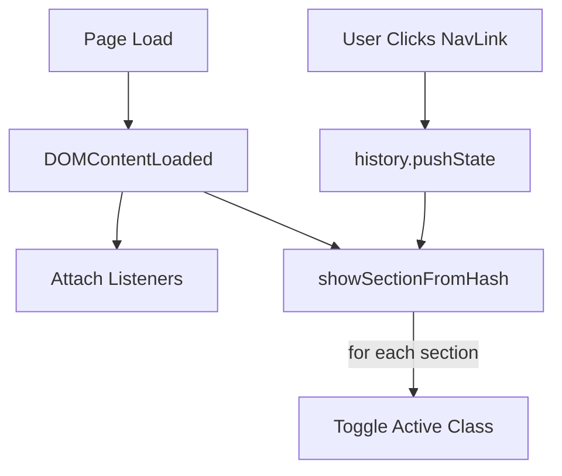
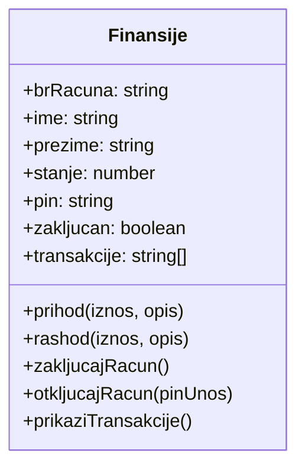

# Personal Financial Tool Documentation 🛠️

This documentation covers the **style.css**, **index.html**, and **script.js** files of the Personal Financial Tool.  
It explains their structure, functionality, and interactions in detail.

## style.css

This stylesheet defines the app’s visual appearance, layout, and responsive behavior.  
It sets global resets, color schemes, component styles, and mobile adaptations.

### Universal & Body Styles

- Resets margins, paddings, and sets `box-sizing` to `border-box`.
- Defines font family, line height, text color, and gradient background.
- Uses flex layout for full-height body.

```css
* {
  margin: 0;
  padding: 0;
  box-sizing: border-box;
}
body {
  font-family: 'Segoe UI', Tahoma, Geneva, Verdana, sans-serif;
  line-height: 1.6;
  color: #333;
  background-color: #f8f9fa;
  background-image: linear-gradient(135deg, #f5f7fa 0%, #c3cfe2 100%);
  min-height: 100vh;
  display: flex;
  flex-direction: column;
}
```

### Container & Layout

- `.container` centers content with responsive width and padding.
- Provides max-width constraint for readability.

```css
.container {
  width: 90%;
  max-width: 1200px;
  margin: 0 auto;
  padding: 0 15px;
}
```

### Header & Navigation

- Styles `header` with dark background, white text, and subtle shadow.
- Lays out title and nav links flexibly.
- Adds hover effect on links.

```css
header {
  background-color: #2c3e50;
  color: white;
  padding: 1rem 0;
  box-shadow: 0 2px 5px rgba(0,0,0,0.1);
}
nav a {
  color: white;
  text-decoration: none;
  font-weight: 500;
  padding: 0.5rem 1rem;
  border-radius: 4px;
  transition: background-color 0.3s;
}
nav a:hover {
  background-color: rgba(255, 255, 255, 0.1);
}
```

### Sections & Animations

- Hides all `main section` by default; shows `.active`.
- Adds `fadeIn` animation for sections.

```css
@keyframes fadeIn {
  from { opacity: 0; }
  to   { opacity: 1; }
}
main section {
  display: none;
}
main section.active {
  display: block;
  animation: fadeIn 0.5s ease-in;
}
```

### Components (Hero, Form, Footer)

- `.hero`: centered card with shadow and rounded corners.
- `form`: styled input, textarea, and button inside white card.
- `footer`: dark bar with center text.

```css
.hero, form {
  background-color: white;
  border-radius: 8px;
  box-shadow: 0 4px 6px rgba(0,0,0,0.1);
  padding: 2rem;
}
button {
  background-color: #3498db;
  color: white;
  padding: 0.75rem 1.5rem;
  border: none;
  border-radius: 4px;
  cursor: pointer;
  transition: background-color 0.3s;
}
button:hover {
  background-color: #2980b9;
}
footer {
  background-color: #2c3e50;
  color: white;
  text-align: center;
  padding: 1.5rem 0;
  margin-top: auto;
}
```

### Responsive Styles

- Adjusts header layout and font sizes below `768px`.
- Centers nav links and stacks title.

```css
@media (max-width: 768px) {
  header .container {
    flex-direction: column;
    text-align: center;
  }
  nav {
    margin-top: 1rem;
    flex-wrap: wrap;
    justify-content: center;
  }
  section h1 { font-size: 1.8rem; }
  .hero h1  { font-size: 2rem; }
}
```

### Custom Tool Wrapper

- `.alati-wrapper` uses CSS Grid for responsive card layout.
- `.alat-card` defines individual tool card styles.

```css
.alati-wrapper {
  display: grid;
  grid-template-columns: repeat(auto-fit, minmax(300px, 1fr));
  gap: 1.5rem;
  margin-top: 2rem;
}
.alat-card {
  background: white;
  padding: 1.5rem;
  border-radius: 8px;
  box-shadow: 0 4px 6px rgba(0,0,0,0.1);
}
```

---

## index.html

This HTML file implements the page structure and navigation of the financial tool.  
It links to **style.css** and **script.js**, and provides sections for home, tools, and contact.

### Document Structure

- `<!doctype html>` defines HTML5 document.
- `<head>` contains metadata, title, viewport, and stylesheet link.
- `<body>` wraps header, main, footer, and script inclusion.

```html
<!doctype html>
<html lang="sr">
<head>
  <meta charset="utf-8" />
  <meta name="viewport" content="width=device-width,initial-scale=1" />
  <title>Lični Finansijski Alat</title>
  <link rel="stylesheet" href="style.css" />
</head>
<body>
  <!-- ... -->
  <script src="script.js"></script>
</body>
</html>
```

### Header Section

- Displays the app title and navigation links.
- Uses anchor hashes to switch sections without reload.

```html
<header>
  <div class="container">
    <h1>Lični Finansijski Alat</h1>
    <nav>
      <a href="#pocetna">Početna</a>
      <a href="#alati">Alati</a>
      <a href="#kontakt">Kontakt</a>
    </nav>
  </div>
</header>
```

### Main Sections

The `<main>` contains three sections toggled by JavaScript.

#### Home Section

- Has `id="pocetna"` and class `hero active`.
- Welcomes the user and guides to tools or contact.

```html
<section id="pocetna" class="hero active">
  <h1>Dobrodošli!</h1>
  <p>Welcome message and navigation hint.</p>
</section>
```

#### Tools Section 🧰

- `id="alati"` holds financial tools.
- Uses `.alati-wrapper` to layout `.alat-card` elements.

| Tool Card               | Description                                        |
|-------------------------|----------------------------------------------------|
| Račun (Account)         | Create account with number, owner, balance, PIN.   |
| Prihod (Income)         | Add income amount and description.                 |
| Rashod (Expense)        | Subtract expense with description.                 |
| Štednja (Savings)       | Calculate principal, rate, years, final amount.    |
| Kredit (Credit)         | Compute loan, rate, installments, or duration.     |
| Istorija transakcija    | Show transaction history list.                     |
| Bezbednost (Security)   | Lock or unlock account with PIN.                   |

#### Contact Section

- `id="kontakt"` contains a contact form.
- Submits to Formspree endpoint for email handling.

```html
<form action="https://formspree.io/f/xldarenl" method="POST">
  <label>Vaš e-mail: <input type="email" name="email" required></label>
  <label>Vaša poruka: <textarea name="message" required></textarea></label>
  <button type="submit">Pošalji</button>
</form>
```

### Footer Section

- Displays dynamic year, app name, author, and contact number.
- Year is filled by **script.js**.

```html
<footer>
  <div class="container">
    <p>&copy; <span id="godina"></span> Lični Finansijski Alat - Mihajlo Ničin<br>+381 064/143-86-00</p>
  </div>
</footer>
```

---

## script.js

This script powers dynamic UI updates, navigation routing, and all financial operations.  
It defines the `Finansije` class and attaches event handlers for each tool.

### Dynamic Year Display

Sets the footer year to the current calendar year.

```js
document.getElementById('godina').textContent = new Date().getFullYear();
```

### Navigation Logic

- Listens for `DOMContentLoaded` to setup routing.
- `showSectionFromHash()` toggles `.active` on sections.
- Updates browser history on nav link clicks.

```js
document.addEventListener('DOMContentLoaded', () => {
  // attach nav link handlers and show initial section
});
```



### Finansije Class 📊

This class models a bank account with methods for transactions and security.



- **Properties** store account data and transaction log.
- **Methods** enforce PIN lock, validate amounts, and format entries.

### Financial Operations Handlers

The script binds UI elements to class methods for each tool.

#### Account Creation

- Validates input fields and PIN length.
- Instantiates `Finansije` object on success.

```js
document.getElementById("kreirajRacun").addEventListener("click", () => {
  // Gather inputs, validate, then:
  racun = new Finansije(br, ime, prez, stanje, pin);
});
```

#### Income & Expense

- Parse amount and description.
- Call `racun.prihod()` or `racun.rashod()`.
- Show result via `alert()`.

```js
document.getElementById("dodajPrihod").addEventListener("click", () => {
  const iznos = parseFloat(...);
  alert(racun.prihod(iznos, opis));
});
```

### Savings & Credit Calculators 💰

- Read selected option from dropdown.
- Use `switch` to compute principal, rate, years, or final amount.
- Display result in `<p class="info">`.

```js
switch (opcija) {
  case "1":
    rezultat = glavnica * Math.pow((1 + kamata/100), godine);
    break;
  // other cases...
}
```

### Transaction History & Security 🔒

- **History**: clears and populates `<ul>` with `prikaziTransakcije()`.
- **Lock/Unlock**: calls `zakljucajRacun()` or `otkljucajRacun(pin)` and updates status.

```js
document.getElementById("prikaziTransakcije").addEventListener("click", () => {
  racun.prikaziTransakcije().forEach(t => {/* append <li> */});
});
```

```js
document.getElementById("zakljucaj").addEventListener("click", () => {
  status.textContent = racun.zakljucajRacun();
});
```

```card
{
  "title": "Data Persistence Notice",
  "content": "All financial data resets on page reload, as it stores in memory only."
}
```
